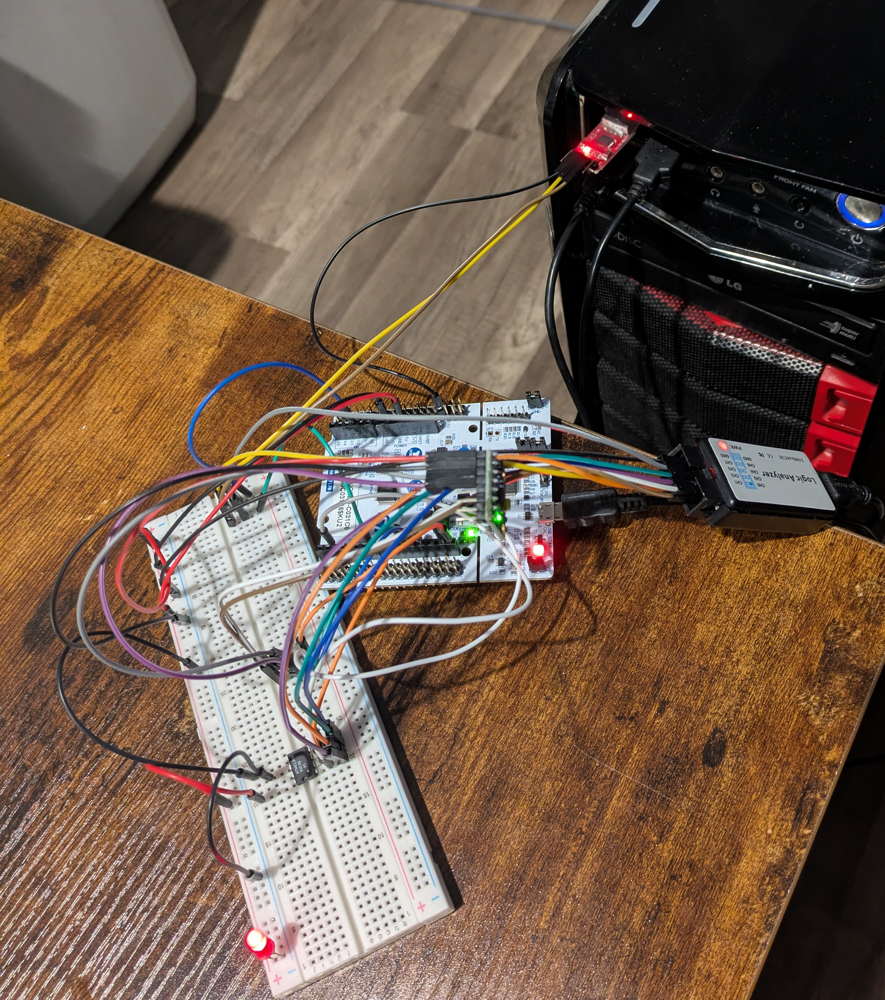
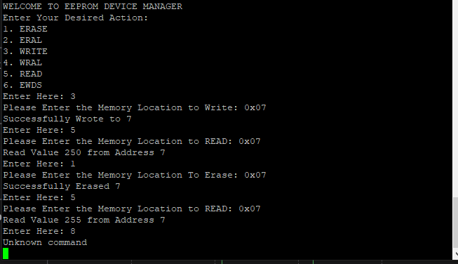
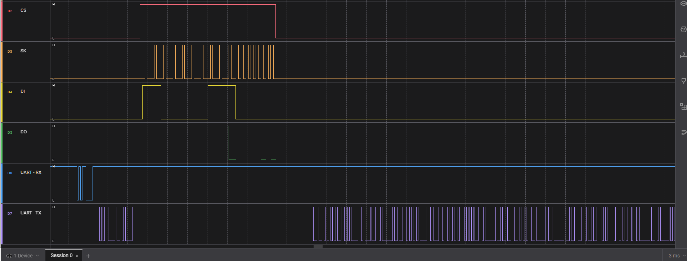

# STM32 Custom EEPROM & Peripheral Driver Development

## 📌 Overview
This project demonstrates the development of **custom low-level drivers** for the ATM93C46 EEPROM on an STM32 microcontroller.  

- Implemented EEPROM communication using **GPIO bit-banging**, derived directly from the chip datasheet.  
- Created a **UART-based PC interface** for issuing EEPROM commands.  
- Configured and integrated an **MPU6050** using STM32CubeMX HAL API.  
- Validated timing and communication protocols using a **Saleae logic analyzer**.  

---

## 🛠️ Features
- Custom EEPROM driver supporting:  
  - READ 
  - WRITE
  - WRITE-ALL (WRAL)
  - ERASE
  - ERASE-ALL (ERAL)
  - WRITE ENABLE (EWEN)
  - WRITE DISABLE (EWDS)
- UART terminal interface for sending commands and monitoring data.  
- MPU6050 integration via I2C.  
- Logic analyzer verification of GPIO waveforms and UART communication.  

---

## ⚙️ Hardware & Tools
- **STM32 C031C6 Nucleo Board**  
- **ATM93C46 EEPROM**  
- **MPU6050**  
- Saleae Logic Analyzer + Software  
- Breadboard, jumper wires, power supply  

📷  
  

---

## 📡 Communication Interfaces
- **EEPROM (ATM93C46):** GPIO bit-banging (based on datasheet timing diagrams)  
- **MPU6050:** I2C (configured via STM32CubeMX HAL)  
- **PC ↔ STM32:** UART  

📷 *Example UART session:*  
  

---

## 🔍 Logic Analysis
Waveforms captured during EEPROM operations using Saleae:  
- Command timing validation 
- Protocol compliance verification  

📷 *Example of custom bit-banged logic and UART*  
  

---

